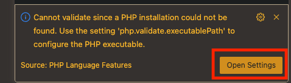
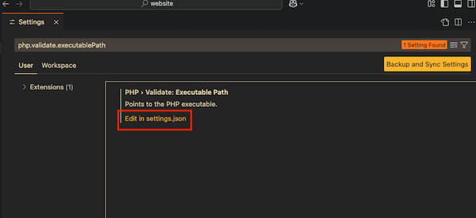
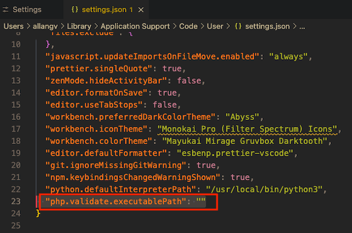
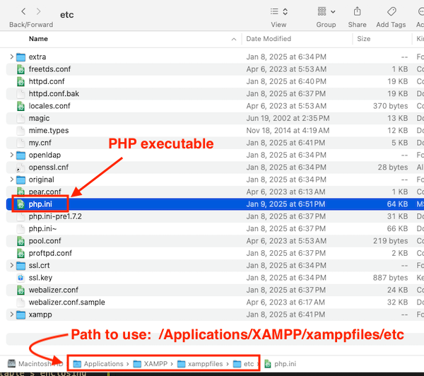

# php-learning

php-learning is a repo that contains my PHP notes and learnings.

## Getting Started

- To run the PHP code in this repo, you will first need to download and install **XAMPP** [here](https://www.apachefriends.org/).

  - XAMPP is a _local web server environment_ which includes **Apache web server** and **MySQL database**, which are 2 essential components for executing PHP scripts on your device.
  - XAMPP allows you to test and develop PHP apps locally before deploying them to a live web server.

- Open the control panel for the XAMPP server.
  - If using Mac OS, the control panel will be called **manager-osx**, and it is located in the _Applications/XAMPP/_ directory.

- The XAMPP control panel looks like the following image on Mac (Window users may see a different UI):

- As shown above, ensure **Apache Web Server** and **MySQL** have a status of "Running" (also indicated by the green circle).

  - Apache Web Server must be running, otherwise XAMPP will be unable to access and serve any web files.

- Clone this repo, and move the repo's root directory (the **website** folder) into the **htdocs** folder that's inside the XAMPP installation directory.
  - Note: In order for XAMPP to properly access and serve web files, all the project files (HTML, PHP, CSS, etc.) must be placed within the "htdocs" folder located inside your XAMPP installation directory.

- Open the **website** folder in your a code editor, ie VS Code.

- In this repo's root directory (**website**), you can now create .php files and view them in the browser.

- Entering **localhost** in your browser's address bar will take you to the XAMPP dashboard. To access the **website** folder and its contents in the browser, enter: **localhost/website**
  - For example, if you created a **test.php** file inside the **website** folder, enter **localhost/website/test** to view the contents of **test.php**.

## VSCode Warning: "Cannot validate since a PHP installation could not be found"

In VS Code, if you're getting the warning, "Cannot validate since a PHP installation could not be found", that means you have to validate the executable path of the PHP executable that's found within the XAMPP server. **To do this, follow the instructions below.**

1. The warning says "Use the setting **php.validate.executablePath** to configure the PHP executable". So, you need to access the **settings** file to do this. In the warning's window, click "Open Settings".

2. A tab opens in VS Code, similar to what's shown below. Click "Edit in settings.json"

3. A settings.json file opens in another tab. Locate the **"php.validate.executablePath"** property/key.

4. The value of this property must be set as the path to the PHP executable which is in the XAMPP server.

5. On your device, find and copy the path to the PHP executable in the XAMPP server.

- Note: For Mac users, the PHP executable is the **php.ini** file located here:
<pre>/Applications/XAMPP/xamppfiles/etc/php.ini (*** SIDE NOTE ONLY - DO NOT USE THIS PATH ***)</pre>

- However, **the path that you need is it's enclosing folder**. Copy this path:
<pre>/Applications/XAMPP/xamppfiles/etc (*** USE THIS PATH ***)</pre>

6. Go back to the settings.json file, and set this path as the string value to the **"php.validate.executablePath"** property.
