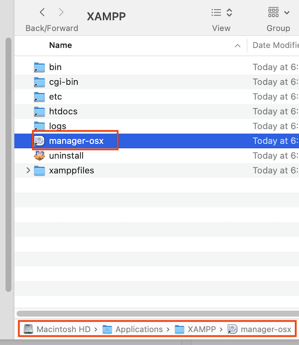
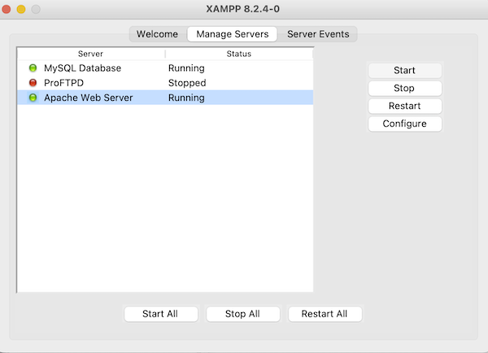
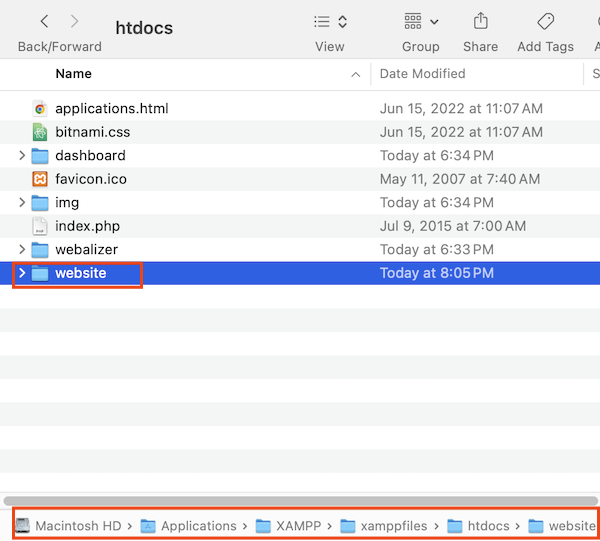

# php-learning

php-learning is a repo that contains my PHP notes and learnings.

## Getting Started

- To run the PHP code in this repo, you will first need to download and install **XAMPP** [here](https://www.apachefriends.org/).

  - XAMPP is a _local web server environment_ which includes **Apache web server** and **MySQL database**, which are 2 essential components for executing PHP scripts on your device.
  - XAMPP allows you to test and develop PHP apps locally before deploying them to a live web server.

- Open the control panel for the XAMPP server.
  - If using Mac OS, the control panel will be called **manager-osx**, and it is located in the _Applications/XAMPP/_ directory.

- The XAMPP control panel looks like the following image on Mac (Window users may see a different UI):

- As shown above, ensure **Apache Web Server** and **MySQL** have a status of "Running" (also indicated by the green circle).

  - Apache Web Server must be running, otherwise XAMPP will be unable to access and serve any web files.

- Clone this repo, and move the folder to the **htdocs** folder inside the XAMPP installation directory.
  - Note: In order for XAMPP to properly access and serve web files, all the project files (HTML, PHP, CSS, etc.) must be placed within the "htdocs" folder located inside your XAMPP installation directory.

- In this repo's root directory (**website**), you can now create .php files and view them in the browser.

- Entering **localhost** in your browser's address bar will take you to the XAMPP dashboard. To access the **website** folder and its contents in the browser, enter: **localhost/website**
  - For example, if you created a **test.php** file inside the **website** folder, enter **localhost/website/test** to view the contents of **test.php**.
